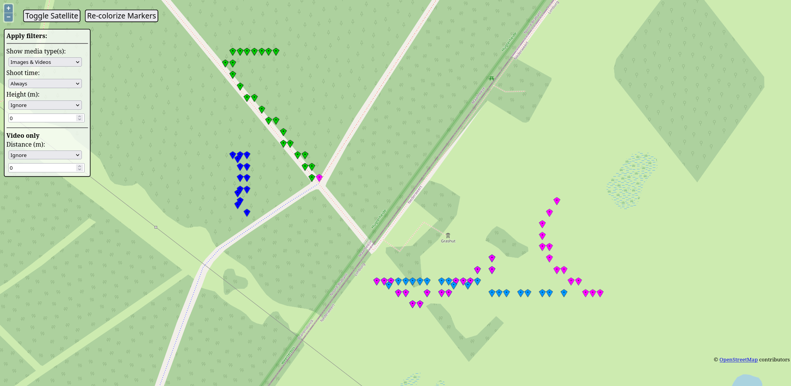
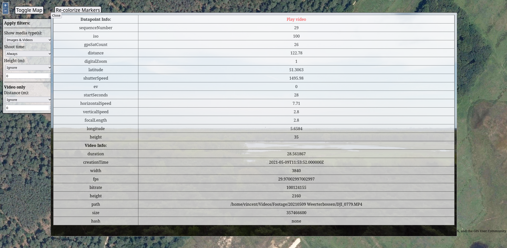

# Drone-Atlas

Drone-Atlas is a Java based application running a web UI that 
helps you discover the footage you made with your DJI drones. 
The app parses the subtitles in your footage, and the EXIF data 
in your images to recover interesting metadata. It then plots
these date points on a map for exploration.

### Current features
- Automatic directory scanning for DJI files.
- Plotting of date points based on GPS on map and satellite views.
- Date point filtering on type, height and date (and distance from operator).
- Preview of the footage at the timestamp of the datepoint.
- Quick opening of the entire media file associated with a date point.

## How to use
1. Download either the `.jar` or the `.exe` from the releases. Use the `.jar` 
   if you have `JDK version 13` or greater installed, or the `.exe` if you want 
   to just run an executable.
   
2. Place the downloaded file into a folder you want. Upon first launch it will create
   a data folder alongside it to store the parsed data from your footage.
   
3. On first run the app will prompt you to select where your
   DJI footage is located.
   
4. You will then see your browser open to the map view for exploration,
  and you will also have a small management window from which you can
   initiate a new scan of the media directory you selected.
   
## Screenshots
Map view

Satellite view

Point inspection

Opening a video

## Build
1. Clone or download this repo.
2. Run `maven clean compile assembly:single` for the `jar` artifact.
3. Creating the following `exe` can be done with Launch4J.

